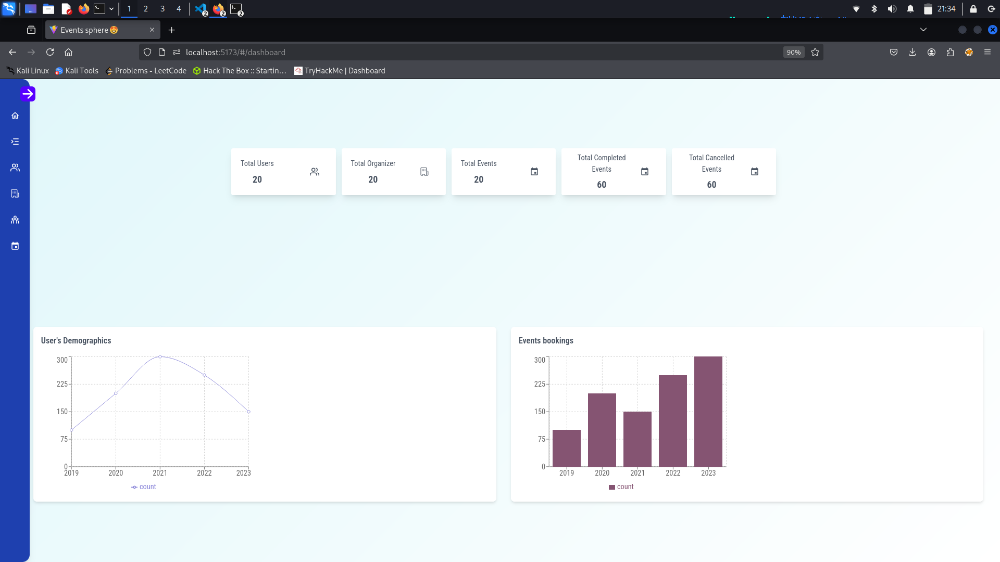
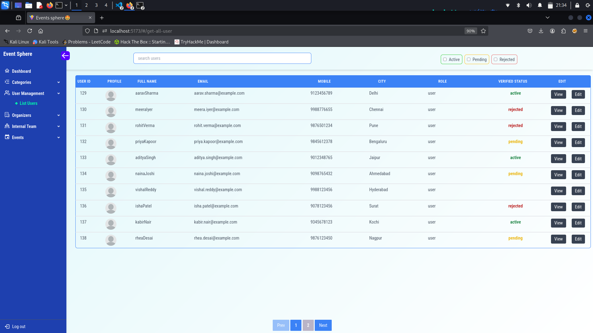
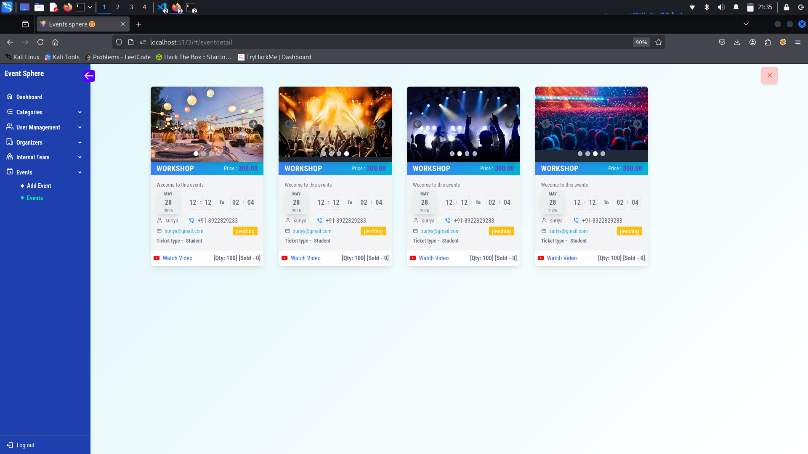
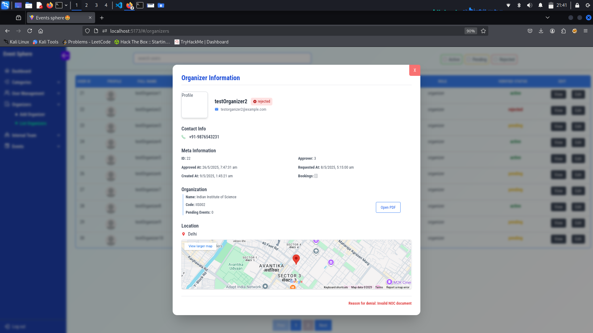
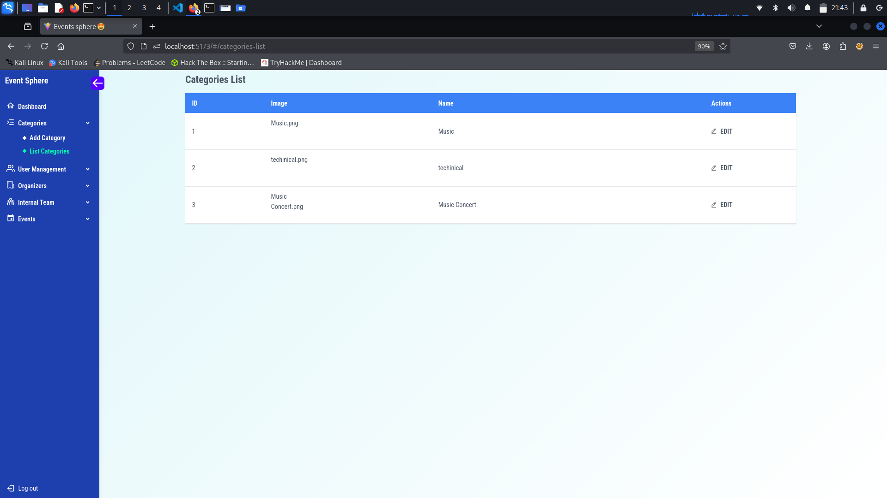

# 🌐 Events-Sphere Admin Panel

A modern and intuitive **web-based administrative interface** for **Events-Sphere**, enabling administrators to manage event submissions, user roles, and platform content with ease.

---

## 📑 Table of Contents
- [✨ Features](#features)
- [🛠 Tech Stack](#tech-stack)
- [📦 Prerequisites](#prerequisites)
- [⚙️ Installation](#installation)
- [🔧 Configuration](#configuration)
- [🚀 Usage](#usage)
- [🌍 Live Demo](#live-demo)
- [📤 Deployment](#deployment)
- [🤝 Contributing](#contributing)
- [📜 License](#license)
- [🖼 Preview](#preview)

---
## 🖼 Preview  

| Dashboard | User Management |
|-----------|-----------|
|  |  |

| Events Management |
|-------------------|
|  |

| Organizers Management | Categories |
|-----------------|-----------|
|  |  |

---

## Login Credentials:
  (Make sure backend is running...)
   - USER_NAME - prasanth123@gmail.com
   - PASSWORD - prasanth123

## ✨ Features
- 🔐 Role-based access control  
- 📋 View, approve, reject, or delete event submissions  
- 👥 User management (edit roles, deactivate accounts)  
- 📊 Dashboard with event and submission analytics  
- 🔎 Search, filtering, and sorting of events/users  
- 📱 Responsive design for mobile and desktop  
- 📝 Activity logging and audit trail  

---

## 🛠 Tech Stack
- **Frontend**: React.js, Tailwind CSS, Redux, React Router, Axios  
- **Authentication**: JWT, role-based access control  
- **Backend**: Node.js, Express.js  
- **Database**: MySQL  
- **Icons**: Lucide-react  
- **Deployment**: Vercel  

---

## 📦 Prerequisites
- Node.js (>=14.x)  
- npm or yarn  
- Access to the main backend API (Events-Sphere) with proper permissions  

---

## ⚙️ Installation
Clone the repository:
```bash
git clone https://github.com/prasanth8961/events-sphere-admin-panel.git
cd events-sphere-admin-panel

```
---

## Install dependencies
```bash
    npm install
    # or
    yarn install
```
---

## Configuration

Create a .env file in the root directory:

   - REACT_APP_API_URL=https://event-backend-0000.onrender.com
   - REACT_APP_JWT_SECRET=your_jwt_secret


---

# Usage

- Start the development server:

```bash
    npm run dev
    # or
    npm start
```

Navigate to http://localhost:3000 to access the admin panel locally.

---

### Live Demo
- [www.admin.app.com](https://eventsphere-admin-panel.vercel.app/)

---

# Deployment

- Build the production-ready UI:

```bash
    npm run build
```
---

# Contributing

### Contributions are welcome! To contribute: 
  1. Fork the repository
  2. Create a new branch (git checkout -b feature/my-new-feature)
  3. Commit your changes (git commit -m "Add new feature")
  4. Push to the branch (git push origin feature/my-new-feature)
  5. Open a pull request for review

---

## License

This project is licensed under the MIT License. See the LICENSE file for
details.
